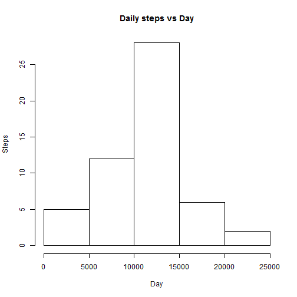
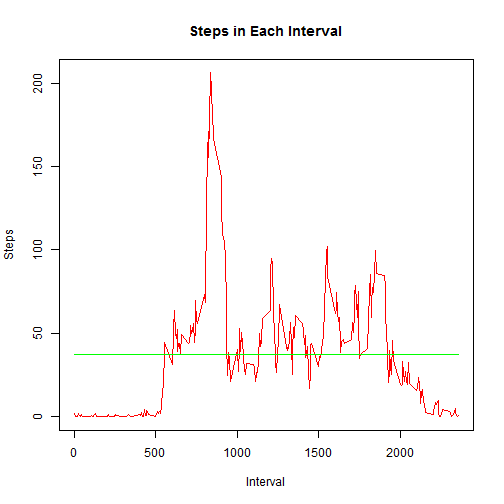
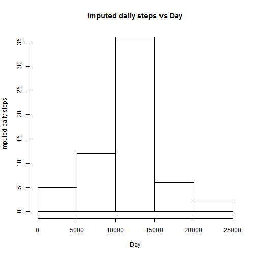

## A: Loading and preprocessing the data

### A1: Load the data (i.e. read.csv()).

If the required csv file exists in the working directory, use the following code.

Read the csv file.


```r
v <- read.csv("activity.csv")
```

If the required csv file has not been downloaded, use a code based on the following.

State the URL for downloading.

z <- "https://d396qusza40orc.cloudfront.net/repdata%2Fdata%2Factivity.zip"

Provide a place for downloading in the system's temp directory.

y <- tempfile(tempdir(), fileext=".zip", method="internal")

Download the file into this place.

download.file(z, y)

Prepare a list of file in the the zip.

x <- unzip(y, list=TRUE)

Take the first filename from this list.

w <- x$Name[1]

Warn and exit if there is no csv file.

if (substr(w, -4, -1)<>".csv") {
   cat("No csv file downloaded.\nExiting\n")
}

Unzip the csv file.

unzip(y, files=w, exdir=td, overwrite=TRUE)

Read the csv file.

v <- read.csv(file.path(tempdir(), w), as.is=TRUE)

### A2: Process/transform the data (if necessary) into a format suitable for your analysis.

Take the read-out as a data frame.


```r
u <- as.data.frame(v)
```

Drop records with missing steps values.


```r
t <- u[!is.na(u$steps),]
```

Compute daily total steps by date.


```r
s <- aggregate(steps ~ date, data = t, sum)
```

## B: What is mean total number of steps taken per day?

### B1: Make a histogram of the total number of steps taken each day.

Prepare a vector of steps values.


```r
r <- s[,2]
```

Make a histogram of these values.


```r
hist(r, main="Daily steps vs Day", xlab="Day", ylab="Steps")
```

 

## B2: Calculate and report the mean and median total number of steps taken per day.

Calculate and report the mean.


```r
q <- mean(r)
q
```

```
## [1] 10766
```

Calculate and report the median.


```r
p <- median(r)
p
```

```
## [1] 10765
```

Mean and median of steps taken per day are 1.0766 &times; 10<sup>4</sup> and 10765.

## C: What is the average daily activity pattern?

### C1: Make a time series plot (i.e. type = "l") of the 5-minute interval (x-axis)
#### and the average number of steps taken, averaged across all days (y-axis).

Compute the steps in ecah interval.


```r
o <- aggregate(steps ~ interval, t, mean)
```

Compute mean of the interval steps.


```r
o$allave <- mean(o$steps)
```

Plot a time series of steps in each interval. Add a line of overall average in the avove plot.


```r
plot(o$interval, o$steps, type='l', col="red", main="Steps in Each Interval", xlab="Interval", ylab="Steps")
lines(o$interval, o$allave, col="green")
```

 

## C2: Which 5-minute interval, on average across all the days in the dataset, contains the maximum number of steps?

Locate the interval of maximum steps.


```r
n <- which.max(o$steps)
n
```

```
## [1] 104
```

Report interval of maximum steps with steps value.


```r
m <- o[n,]
m
```

```
##     interval steps allave
## 104      835 206.2  37.38
```

Maximum number of steps is 206.1698 and occurs at interval 835.  

## D: Imputing missing values

Note that there are a number of days/intervals where there are missing values (coded as NA).
The presence of missing days may introduce bias into some calculations or summaries of the data.

### D1: Calculate and report the total number of missing values in the dataset (i.e. the total number of rows with NAs).

Calculate and report the total number of missing steps in the dataset.


```r
l <- nrow(u[is.na(u$steps),])
l
```

```
## [1] 2304
```

Total number of missing steps in the dataset is 2304.

### D2: Devise a strategy for filling in all of the missing values in the dataset.
#### The strategy does not need to be sophisticated.

For example, you could use the mean/median for that day, or the mean for that 5-minute interval, etc.

Make a new dataset by copying the original dataset.


```r
k = u
```

Loop through this new dataset's records. If the steps value is not given, use average steps value for that interval (from C1).


```r
for (j in 1:nrow(k)) {
    if (is.na(k$steps[j])) {
        k$steps[j] <- o$steps[which(o$interval == k$interval[j])]
    }
}
```

### D3: Create a new dataset that is equal to the original dataset but with the missing data filled in.

The new dataset as processed through the above for loop is equal to the original dataset but with the missing data filled in.

### D4: Make a histogram of the total number of steps taken each day.
#### Calculate and report the mean and median total number of steps taken per day.
#### Do these values differ from the estimates from the first of the assignment?
#### What is the impact of imputing missing data on the estimates of the total daily number of steps?

Compute total daily steps values for the new dataset.


```r
h <- aggregate(steps ~ date, data = k, sum)
```

Make a histogram of total daily steps values for the new dataset. 


```r
g <- h[,2]
hist(g, main="Imputed daily steps vs Day", xlab="Day", ylab="Imputed daily steps")
```

 

Compute mean and median steps values for the new dataset.


```r
f <- mean(g)
f
```

```
## [1] 10766
```

```r
e <- median (g)
e
```

```
## [1] 10766
```

Report the impact of adding missing steps values on the mean.


```r
if (f > q) {
    print("Imputing increases the mean value.")
} else if (f == q) {
    print("Imputing does not change the mean value.")
} else {
    print("Imputing decreases the mean value.")
}
```

```
## [1] "Imputing does not change the mean value."
```

Report the impact of adding missing steps values on the median.


```r
if (f > p) {
    print("Imputing increases the median value.")
} else if (f == p) {
    print("Imputing does not change the median value.")
} else {
    print("Imputing decreases the median value.")
}
```

```
## [1] "Imputing increases the median value."
```

## E: Are there differences in activity patterns between weekdays and weekends?

For this the weekdays() function may be of some help here. Use the dataset with the filled-in missing values for this part.

### E1: Create a new factor variable in the dataset with two levels -
#### "weekday" and "weekend" indicating whether a given date is a weekday or weekend day.

Add a column for weekday number computed from the date.


```r
k$wkdy <- weekdays(as.Date(k$date))
```

Add a column and fill it up as weekday.


```r
k$dayend <- c("weekday")
```

Add sqldf library.


```r
library(sqldf)
```

```
## Loading required package: gsubfn
## Loading required package: proto
## Loading required package: RSQLite
## Loading required package: DBI
## Loading required package: RSQLite.extfuns
```

```r
library(tcltk)
```

Change the new column to weekend according to the weekday number.


```r
d <- sqldf(c("update k set dayend='weekend' where wkdy='Saturday' or wkdy='Sunday'", "select * from k"))
```

### E2: Make a panel plot containing a time series plot (i.e. type = "l") of the 5-minute interval (x-axis)
#### and the average number of steps taken, averaged across all weekday days or weekend days (y-axis).
#### The plot should look something like the following, which was creating using simulated data.

Add ggplot2 library.


```r
library(ggplot2)
```

Compute mean steps values for each interval separately for weekdays and weekends.


```r
c <- aggregate(steps ~ dayend + interval, data = d, mean)
```

Add quickplots of timeserii for weekdays and weekends.


```r
b <- qplot(interval, steps, data=c, geom=c("line"), xlab="Interval", ylab="Number of steps", main="") + facet_wrap(~dayend, ncol=1)
b
```

 

Clear all variables from the memory.


```r
rm(list = ls())
```
